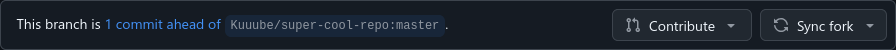
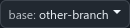

# How to manage a forked repo

I will use Github as the host in these examples but the same applies to other hosts.

## Creating the fork

1. Navigate to the repo and in the top right, click the fork button.

2. Clone the repo locally by taking the URL of the forked repo and running this:

    ```
    git clone YOUR_URL
    ```

3. Navigate into or open your terminal in the folder created by `git clone`.

## Making a pull request

1. Checkout the branch you are basing your pull request off of. Usually this will be the default branch. If you are unsure, pull up the repo in your web browser and check which branch the repo shows by default.

    ```
    git checkout master
    ```

2. Create a new branch and checkout that branch. There are two ways to do this:

    ```
    git branch YOUR_BRANCH_NAME
    git checkout YOUR_BRANCH_NAME
    ```
    OR
    ```
    git checkout -b YOUR_BRANCH_NAME
    ```

3. Make all the changes you need to on the files in the repo. Commit your changes. Push the changes.

4. In your browser, go to the upstream repo (the one you created the fork from). You should see a banner that asks if you want to make a pull request. Click `Compare & pull request`.

    

    If you don't see this banner, that's no issue. Go to your fork, select the branch, click `Contribute`, and `Open pull request`.

    

For more information check Github's documentation on pull requests: [Creating a pull request - Github](https://docs.github.com/en/pull-requests/collaborating-with-pull-requests/proposing-changes-to-your-work-with-pull-requests/creating-a-pull-request#creating-the-pull-request).

## Updating the fork

1. Add the upstream repo (the one you created the fork from) as a remote. You only need to do this once per repo. Skip to step 2 if you're updating a second time.

    ```
    git remote add upstream UPSTREAM_REPO_URL
    ```

2. Run the following commands. Make sure to replace `master` with what your repo uses as its default branch.

    ```
    git checkout master
    git fetch upstream
    git merge upstream/master
    ```

## Force resetting the fork

If something has gone horribly wrong and when you run `git merge upstream/master` it comes up with merge conflicts and chaos, don't worry it can be force reset.

ONLY do this if `git merge upstream/master` does not work.

1. Triple check that you know what the default branch is. Most commonly it will be named `master` or `main`. If you are unsure, pull up the repo in your web browser and check which branch the repo shows by default.

2. Run the following commands. Make sure to replace `master` with what your repo uses as its default branch.

    ```
    git checkout master
    git reset --hard upstream/master
    ```

## Working on other branches

You might not always be working on the default branch. Here's an example of updating a branch named `other-branch` and making a pull request targeting that branch.

```
git checkout other-branch
git fetch upstream
git merge upstream/other-branch

git checkout -b super-cool-feature

git commit -m "Added super cool feature"
git push origin/super-cool-feature
```

All of the above instructions still apply with other branches. Just replace the default `master` branch with the branch you're working on.

When creating a pull request to a different branch, make sure you select the correct base branch to compare to. By default, the default branch will be selected and your changes will not go to the correct place. In this example, `other-branch` must be selected.


